# HIVBackCalc App Instruction Manual


# Introduction

HIVBackCalc is a tool for the estimation of HIV incidence and undiagnosed cases. The method combines data on the number of diagnoses per quarter with information on the distribution of the time between HIV infection and diagnosis, or TID. These two elements are used to backcalculate the number of incident cases per quarter that must have occurred in order to produce the observed diagnoses. The number of undiagnosed cases per quarter are those cases estimated to have already been infected but not yet diagnosed in the quarter. Because TID is not directly observed, the method uses the time between last negative HIV test and diagnosis to approximate TID. This inter-test interval or infection period window is obtained from testing history data.

HIVBackCalc performs its estimation in R, a free software environment for statistical computing and graphics. The HIVBackCalc app is a browser-based user-friendly interface to R. The app can be run online or locally on a user's machine using a platform called RShiny. 

Even for users who ultimately wish to run the app locally, we recommend starting with the online version and the embedded sample dataset. This manual thus begins with [system](#system-requirements) and [data](#data-requirements) requirements and then moves into a [guided analysis using a sample dataset with the online system](#running-the-app-online). Subsequent sections provide instructions for local installation: first [in detail for those new to R](#running-the-app-locally) and then as a [quick guide for those familiar with R](#running-the-app-locally-quick-guide). 

[Back to Table of Contents](#TOC)

# System requirements

## Web browser
Google Chrome is recomended. There are know issues with older versions of Internet Explorer, and other browsers have not been tested.

## R Software
R software is necessary only for running the app locally. Download instructions are provided in the [local installation guide](#running-the-app-locally).

[Back to Table of Contents](#TOC)

# Data requirements

The variables required for the estimation are described below, along with formatting guidance. While any testing history data with the required variables may be used, the tool is specially designed to work with testing history data from the Enhanced HIV/AIDS Reporting System (eHARS).  If your data come from eHARS, the [Using eHARS data](#using-ehars-data) section will guide you through extracting the required variables and using the app to format them.

The app does come with a built-in, sample dataset. Please skip to [Running the app online](#running-the-app-online) to explore the app and the method with the sample data. **Even if you ultimately plan to analyze your own data, we strongly recommend that you explore the app with the sample data before beginning your own analysis.**

## File format

Data should be stored in a comma-separated values file, .csv. In Excel, choose "Save As" and select "Comma-Separated Values" to generate a .csv file of your data.

## Using eHARS data

If your data come from eHARS, you simply need to extract the necessary eHARS variables into a .csv file.

### Extracting data from eHARS

eHARS testing histories should be extracted from the "person-view" dataset. Use the following SAS script to extract the necessary variables (after clicking on the link, right-click on any white space and use _save as_ to download the script to your computer):

([SAS Extraction code](https://raw.githubusercontent.com/netterie/HIVBackCalc_App/master/development/Common Read In CBA.sas))

*Reminder:* the SAS script requires that the eHARS data are in the "person-view" data file structure.     

### eHARS "person view" variables   
The script will extract the following variables:

eHARS name  | Description | Type
------------- | ------------- | -------------
hiv_aids_age_yrs | age at diagnosis in years |
race | race  | categorical
trans_categ | mode of HIV transmission | categorical
hiv_dx_dt | date of first pos HIV test (lab confirmed) |
aids_dx_dt | date of first AIDS classifying condition |
screen_last_neg_dt | date of last neg HIV test (lab confirmed) |
cd4_first_hiv_dt | date of earliest CD4 |
cd4_first_hiv_type | type of CD4 test | count or percent
cd4_first_hiv_value | result of CD4 test |
vl_first_det_dt | date of earliest detectable viral load |
vl_first_det_value | value of detectable viral load |
rsh_state_cd | state of residence at HIV diagnosis |
tth_ever_neg | TTH: Y/N ever had a neg HIV test |
tth_last_neg_dt | TTH: date of last neg HIV test |
tth_first_pos_dt | TTH: date of first pos HIV test |

## Required variables and formatting

If your data do not come from eHARS, you will need to construct the required variables with the appropriate formatting:

Variable name  | Description | Type | Values
------------- | ------------- | ------------- | -------------
Population | area identifier | character | e.g, "Seattle/King County"
race | race | character | any
mode | mode of transmission groups | character | any
mode2 | mode of transmission: MSM vs non-MSM | character | "MSM" and "non-MSM"
hdx_age | age at diagnosis | numeric integer | e.g., 30
agecat5 | 5-year age groups | character | e.g., "30-34"
everHadNegTest | ever had a negative HIV test | character | TRUE, FALSE, or blank
yearDx | year of diagnosis | numeric | e.g., 2006
timeDx | quarter-year of diagnosis* | numeric | e.g., 2006.5
infPeriod | time from last negative test to diagnosis, in years | numeric | e.g., 1.48

*Use the left bound of the quarter, e.g., Q1 of 2006 is 2006.0; Q4 is 2006.75

## Missing values

Missing values should be indicated by blank cells. 

The variables *hdx_age* and *timeDx* cannot have missing values; individuals with missing values will be excluded from the analysis. However, if there is partial information on the time of diagnosis (e.g., year is known but not month), assumptions should be applied to retain the record in the analysis. 

If you have eHARS data, these assumptions will be automatically applied within the app, but if you format the data yourself, you will have to apply them:

Missing Issue | Formatting Assumption
------------------------ | ---------------------------------------------
Missing month | Month (diagnosis or last neg test) assumed July for computing infPeriod; diagnosis quarter randomly assigned	
Missing month, with diagnosis and last neg test in same year and diagnosis before July | Last neg assumed Jan 1  
Missing day	| Day (diagnosis or last neg test) assumed 15th for computing infPeriod	
Missing day, with diagnosis and last neg test in same month and diagnosis before 15th | Last neg day assumed 1st of month	
Illogical last negative	| Last negative date overwritten as missing because recorded as at or after diagnosis


[Back to Table of Contents](#TOC)

# Running the app online
The app can be run online or locally, from your own machine (instructions in the [next section](#Running-the-app-locally). **Even if you ultimately plan to analyze your own data locally, we strongly recommend that you explore the app with the sample data before beginning your own analysis.** This can be done before the app is set up locally by using the online version.

Using the link below, open the online app in a new tab and follow the steps below to do an example analysis.

([https://hivbackcalc.shinyapps.io/main](https://hivbackcalc.shinyapps.io/main))

## Navigation

The six tabs displayed at the top, from _Load Data_ to _About_, allow you to navigate through the major elements of the analysis and access supporting documentation.  

<center>
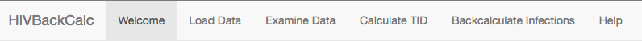
</center>


## Loading data

__Warning: data uploaded to the online version of HIVBackCalc are not secure__

### Selecting the data file

The app opens with the _Load Data_ tab. Select a dataset using the gray left panel:

1. _Sample data_: By default, the sample dataset is selected. These data are simulated to approximate testing histories observed in MSM in Seattle/King County, WA. 

2. _Upload data_: Select "Upload data" from the drop-down menu to load your own data into the app. 
    + A prompt to choose a comma-separated values (CSV) file from your hard drive will appear. These data should either be [variables extracted from eHARS](#using-ehars-data) or data formatted [according to the instructions in section 3](#required-variables-and-formatting).  
    + **If you are uploading data that are extracted directly from eHARS, check the box marked "Is this raw eHARS output?"**

The right panel with the sub-tab labeled "Confirm Data" displays the first 10 rows of the selected dataset.

<center>
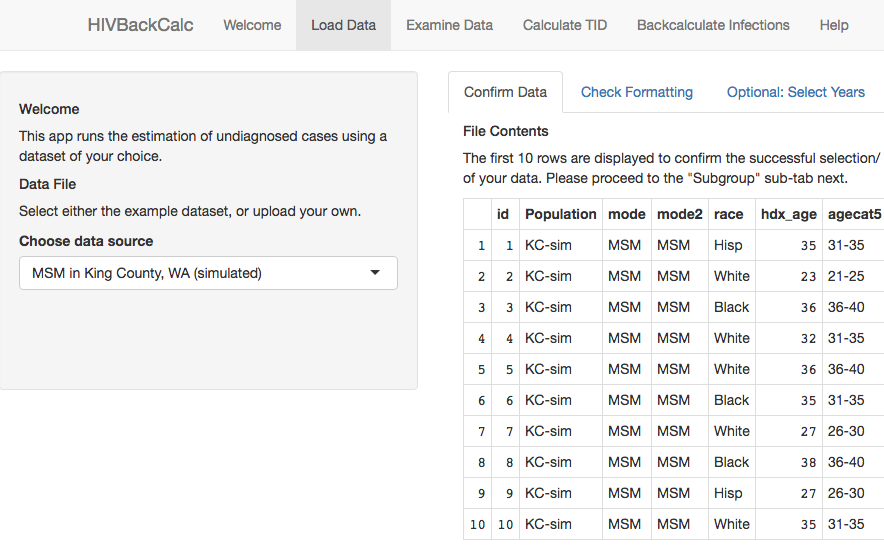
</center>

### Checking formatting

Regardless of whether you prepare your data yourself (as in [Required variables and formatting](#required-variables-and-formatting) or simply extract eHARS variables from eHARS (as in [Extracting data from eHARS](#extracting-data-from-ehars) ), the app will peform some formatting and logic checks. These appear in the "Check Formatting" tab. 

<center>
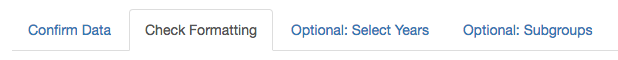
</center>

The app checks and provides feedback about comman formatting issues:

1. **Presence of testing histories**
    + The app reports the years represented in the data and flags years that have very few diagnoses or reported last negative tests
2. **Responses to "Have you ever had a negative test?"**
    + The variable _everHadNegTest_ can only be TRUE, FALSE or missing (NA)
3. **Assumption for those with no prior testing history**
    + HIVBackCalc makes an assumption for these cases, that their earliest possible date of infection was either age 16, the median age of sexual debut in the US, or 18 years prior to diagnosis, whichever is more recent. 
    + The app checks whether this assumption has been applied to the data. See below for more information.
4. **Maximum infection window**
    + HIVBackCalc assumes that all individuals are diagnosed within 18 years of infection, so it checks whether there are reported last negative tests further back than 18 years prior to diagnosis. See below for more information.
    
If you loaded eHARS data directly into the app, you will see an additional 5th section that reports on the formatting applied to the eHARS data, included items 3 and 4 from the above list.

If you prepared the data yourself, you should see that items 3 and 4 in the above list report that the assumption has not been applied to the data. Scroll to the bottom of the page and press the "Format Data" button. A table will appear that details the assumptions applied and the number of records affected. 

<center>
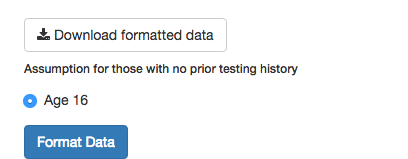
</center>
<br>

Click the "Download formatted data" button to save the formatted dataset.

### Selecting years

You may use the slider on the "Select Years" tab to limit your analysis to a subset of years in your data. 

<center>
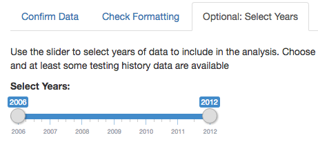
</center>

### Specifying subgroups

If you wish to analyze a sub-sample of the data rather than all the records in the dataset, click on the "Optional: Subgroups" sub-tab. You can then select a variable by which to subset the data and below, select the subgroup. 

<center>
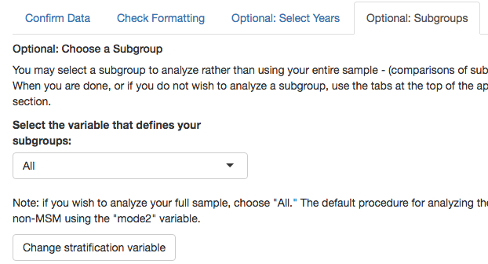
</center>

The "Note" under the drop-down menu highlights that HIVBackCalc's default for analysing the full sample is to stratify the analysis by MSM vs non-MSM (the "mode2" variable). You may press the "Change stratification variable" button and select "None" to analyze a full sample without stratification. This may be necessary if the sample is small. 

If a subgroup is selected, rather than "All", then HIVBackCalc does not stratify the estimation by MSM vs non-MSM.

### Uploading PLWH data

HIVBackCalc estimates undiagnosed case counts for the years represented in the dataset. To estimate an undiagnosed fraction, the tool needs a PLWH estimate from an external source. 

When the sample dataset is selected, the "Optional: PLWH" tab displays the PLWH data for Seattle/King County. 

<center>
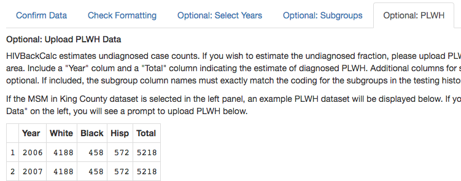
</center>
<br>

If you upload data, you will see a prompt to upload your own file. Format your PLWH data to have a "Year" column and a "Total" column with the PLWH estimate. 

If you have PLWH data broken down by subgroups, you can include those as additional columns. These subgroup column names should match their respective subgroup identifiers in the dataset (e.g., in the sample dataset, the "race" subgroups are coded "White", "Black", and "Hisp"). This will allow you to estimate the undiagnosed fraction for those subgroups, if you choose to do a [subgroup analysis](#specifying-subgroups).

## Looking at your data with the HIVBackCalc App

Now, click on the _Examine Data_ tab at the top of the app.  

1. This tab opens with an "Overview" sub-tab, which describes the dataset by demographic groups and shows the testing history responses within each group. The first row describes the full sample. In the sample data, N=1522 and of those cases, 73% had a reported date of last negative test (% Yes), 11% reported having no negative test prior to diagnosis (% No), and 16% had missing testing history data. 

<center>
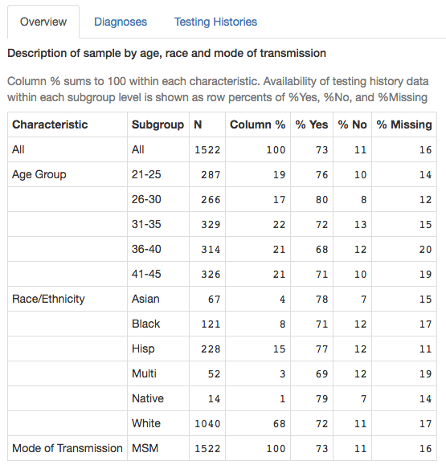   
</center>
<br>

2. By clicking the "Diagnosis" sub-tab you can see the number of newly diagnoses cases during each quarter year.  In the sample data, there are fluctuations from quarter to quarter but there is no obvious trend from 2006 to 2012. 
    + Note: clicking on the plot will display the coordinates in the gray box above the plot (x=Time, y=Diagnoses).    

<center>
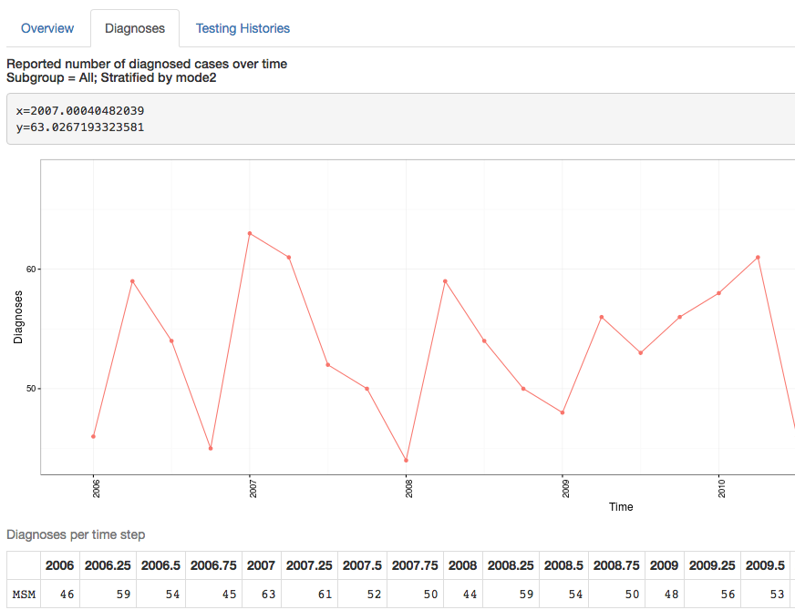
</center>
<br>

3.  By clicking the _Testing Histories_ tab you can see the percentage of respondents that report having had a prior test at each time interval which is between 70% and 80% in these data.  The cases for whom there are no prior test data are further divided into those that are known to have not had a prior test and those for whom prior test data are not known.  
    + Note: clicking on the plot will display the coordinates in the gray box above the plot (x=Time, y=Percent).
    
<center>
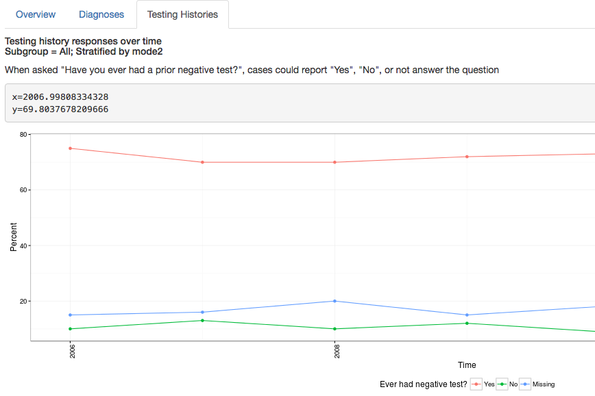
</center>

## Calculate the TID

After the data have been reviewed, the analysis begins with the _Calculate TID_ tab at the top of the page.  Recall that TID refers to the time from infection to diagnosis, the time that an individual spends in the undiagnosed state. HIVBackCalc estimates this time from the testing history data using two different assumptions:

1. Base Case - Missing testing history data are considered missing at random and are excluded from calculating the TID. The probability of infection is uniformly distributed between the time of last negative test and time of diagnosis.

2. Upper Bound - Missing testing history data are considered missing at random and are excluded from calculating the TID. Infection is assumed to occur immediately following the date of last negative test, a worst case assumption.

The TID under these two assumptions are plotted together in a two-panel plot. The top panel is the probability distribution: for each time point on the x-axis, the y-coordinate gives the fraction of cases diagnosed in that quarter. In the sample data, for example, a little over 30% of cases are diagnosed in the first quarter of being infected under the base case assumption (time=0); using the upper bound assumption, however, only about 10% of cases are diagnosed within 1 quarter of being infected. 

The bottom panel shows the corresponding survivor distribution, i.e. the y-axis represents the fraction of the population undiagnosed and the x-axis is time in years. This information is repeated in tabular form below the plot. In the sample data, the Base Case estimates that about half (52%) of cases remain undiagnosed at 0.5 years after diagnosis, while the Upper Bound estimates 75% remain undiagnosed at 0.5 years.  At 18 years the undiagnosed fraction drops to zero in both cases.  This is due to the assumption in the model that infections are highly likely to progress to symptomatic AIDS and be diagnosed within 18 years. 

<center>
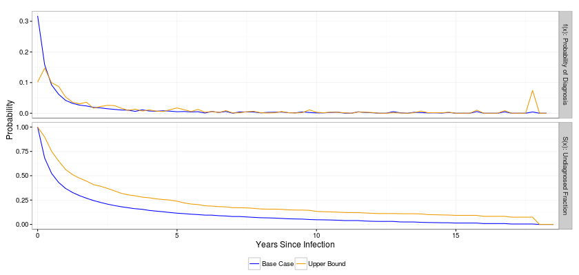  
</center>

  
## Running the backcalculation

Click on the _Backcalculate Infections_ tab at the top of the app to get to the backcalculation section.  Clicking on the _Run backcalculation_ button on the left will run the backcalculation.  This may take a few moments, as indicated by the progress message.

### Incidence and undiagnosed counts

Plots and a table appear after the backcalculation is complete. They provide quarterly diagnosis counts along with estimated quarterly incidence and undiagnosed counts.  Each assumption for the TID, Base Case and Upper Bound, generates separate incidence and undiagnosed estimates.  While the plots show these statistics for each quarter within the data's time period, the table summarizes them over all quarters.  


<center>
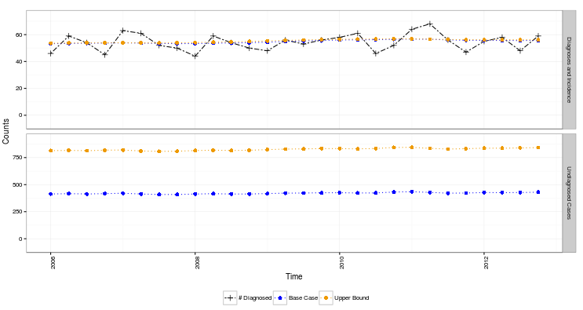 
<br>
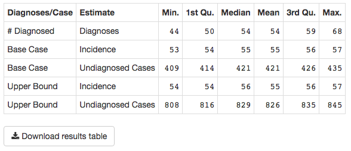 
</center>

In the sample data, the different assumptions had little impact on the estimated incidence but a substantial impact on the estimates of the number of undiagnosed cases. This is because undiagnosed cases in 2006-2012 arise from incident cases from up to 18 years prior. The Base Case and Upper Bound make assumptions about how the incident cases are distributed over that entire time period, while the plot only depicts 2006-2012 incidence.   

Click the "Download Results" button to download results for each year. You will notice that in the downloaded table, there is a range of estimates for each year. This reflects the range of estimates across the 4 quarters of the year. 

### The undiagnosed fraction

If you provided PLWH data, HIVBackCalc will also estimate the undiagnosed fraction. These results will be included in the downloadable table and displayed in two additional graphs. 

The first is a 3-panel figure that shows how each estimation step that produced the undiagnosed fraction for the Base Case and Upper Bound. In each panel, the bottom of the bar gives the Base Case estimate and the top gives the Upper Bound estimate. The undiagosed counts (top panel) are _added_ to the PLWH data to yield "true prevalence," the sum of undiagnosed counts and the diagnosed PLWH estimates (middle panel). The percent undiagnosed is computed as undiagnosed counts divided by true prevalence (bottom panel). 

<center>
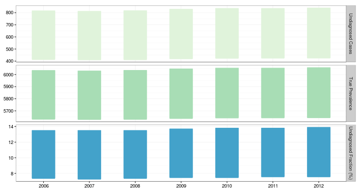 
</center>
<br>

The second figure displays the same information as the first, but in a different format. In this figure, the Base Case estimates are in the left panel and the Upper Bound estimates are in the right panel. The length of each bar represents true prevalence, the sum of the diagnosed PLWH estimate (green) and the estimated undiagnosed counts(blue). The diagnosed and undiagnosed fractions are overlayed as text on the bars. In the sample data, the blue portions of the bars show that over 2006-2012, the undiagnosed fraction estimates were 7-14%.

<center>
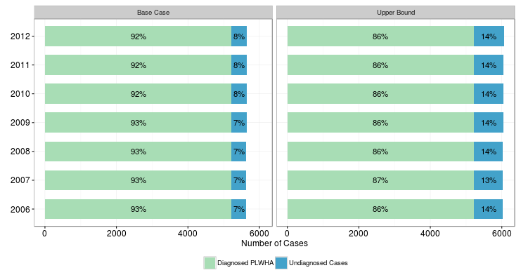 
</center>


[Back to Table of Contents](#TOC)

# Running the app locally

To ensure data privacy, you may choose to load the app locally rather than use the online version. Running the app locally requires installing R and some related extensions. Users already familiar with R may skip forward to the [quick guide for local installation](#running-the-app-locally-quick-guide).  

## Downloading R and RStudio

The app has a minimum R requirement of R version 3.1.2.   
To download the R software package, click on the link below and select the appropriate OS (Windows, Mac or Linux). 

[http://cran.rstudio.com](http://cran.rstudio.com)

Next, install Rstudio.  This step is optional but recommended, as Rstudio provides a tidy interface for R that is popular with both new and experienced R users.  Download and install Rstudio by clicking the link below. 

[http://www.rstudio.com/products/rstudio/download](http://www.rstudio.com/products/rstudio/download)
    
## Downloading R packages

### devtools
After installing R and Rstudio, install several R extensions called "packages" will also need to be downloaded and installed.  To download and install the _devtools_ package:  

1. Open RStudio
2. Type or copy the following lines into the R console window, hitting return after each line:

```r
install.packages('devtools')
library(devtools)
```

When installing _devtools_ R will automatically install any additional packages that are required by the _devtools_
package.  R will provide output indicating which additional packages are being installed.  See the example below:

<center>
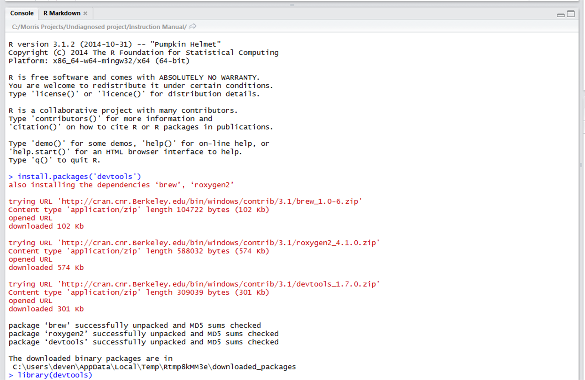
</center>
<br>

*Note:* If you are running either Windows 7 or Windows 8 you may get a notification that you can not write to the 'R\libraries' folder.  This may occur as a result of the default "read only" setting applied to this folder.  You can either change the folder setting or select an alternate folder to store your R packages. Also, disregard any warnings in the console regaurding the installation of _rtools_.    
  
### HIVBackCalc

Next, install the HIVBackCalc package from its [repository on GitHub](https://github.com/hivbackcalc/package1.0):

```r
devtools::install_github('hivbackcalc/package1.0/HIVBackCalc', build_vignettes=FALSE)
```

Note that the "build_vignettes" argument in the above code is set to FALSE because users of the app will probably not need to access the package vignette, a guide to using the R code in the HIVBackCalc package. For R users interested in the package, [see the GitHub repository](https://github.com/hivbackcalc/package1.0). You may need to install the 'pandoc' package in order to build the vignette. 

### shiny

The shiny package links the HIVBackCalc method to its "RShiny" web interface, the browser-based click-and-point app that you used with the sample data in [section 4](#running-the-app-online). 

The RShiny R package and its dependencies are required to run the app.  To download the this software type or copy and paste the command below in to the Rstudio console.  This command will install RShiny and its dependencies. As this command is executed R will provide information about all of the dependencies that are also being installed.

```r
install.packages('shiny')
```

<center>
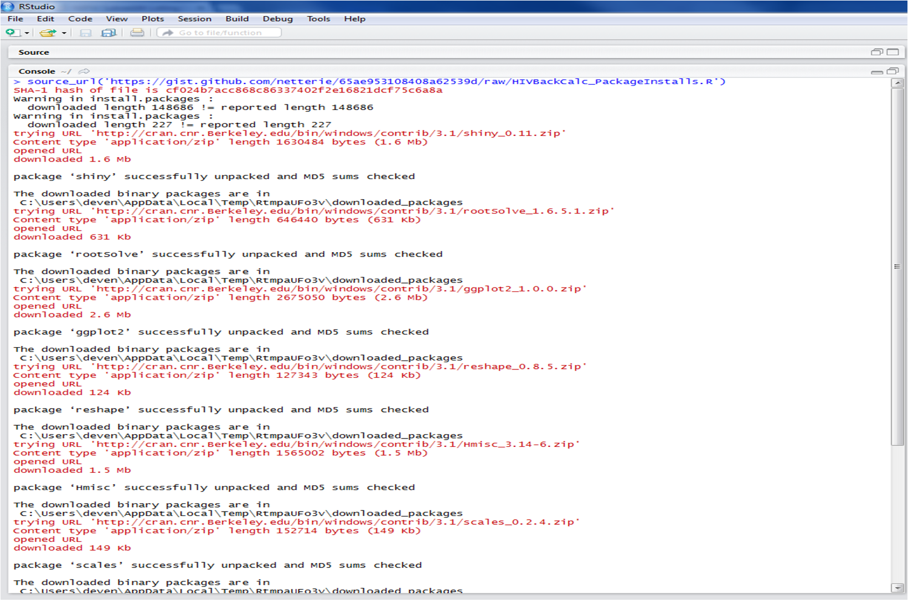
</center>

Start RShiny with R by typing the following into the R console window and hitting return:

```r
library(shiny)  
```

## Downloading the HIVBackCalc app

Once shiny is running in the R session, launch the app locally by typing the code below in to the R console window (or cut and paste) and pressing enter:

```r
shiny::runGitHub('hivbackcalc/app', launch.browser=TRUE)  
``` 

If an error appears after the above step, e.g. "cannot open URL", use these alternate instructions.

1. In a browser, navigate to https://github.com/hivbackcalc/app
2. Click the "Download ZIP" button in the bottom right corner  
3. Rename the file "app.zip" (remove the -master part) and save to a simple location, e.g. C:  
4. Unzip the .zip file in that location  
5. In R, type the following, hitting "enter" after each line. The syntax below assumes that the folder has been unzipped to C:\, so the folder C:\app is on the machine. If a different location is selected for the HIVBackCalc app, replace C:\ with the appropriate location, using only forward slashes instead of backslashes, as shown below.  

```r
setwd('C:/app')
library(shiny)
runApp(, launch.browser=TRUE)
```

## Using the app
The app is now live on your local machine rather than through the online host, but is otherwise identical. See [Overview of the app](#overview-of-the-app) and subsequent sections for a guide to using the app.

## Ending your session

To close the interface, return to R/RStudio and hit the Esc button. 

[Back to Table of Contents](#TOC)

# Running the app locally quick guide

## Downloading R packages and the HIVBackCalc app
If the user is familiar with R, execute the following lines of code to launch the app locally. The code below uses the _devtools_ package to install dependencies and access the app code stored on GitHub. 

If an error appears, e.g. "cannot open URL", try the alternate instructions given [here](#downloading-the-hivbackcalc-app).

```r
install.packages('devtools')
install.packages('shiny')
devtools::install_github('hivbackcalc/package1.0/HIVBackCalc', build_vignettes=FALSE)
shiny::runGitHub('hivbackcalc/app', launch.browser=TRUE)
```

## Using the app
The app is now live on your local machine rather than through the online host, but is otherwise identical. See [Overview of the app](#overview-of-the-app) and subsequent sections for a guide to using the app.

## Ending your session

To close the interface, return to R/RStudio and hit the Esc button. 

[Back to Table of Contents](#TOC)

